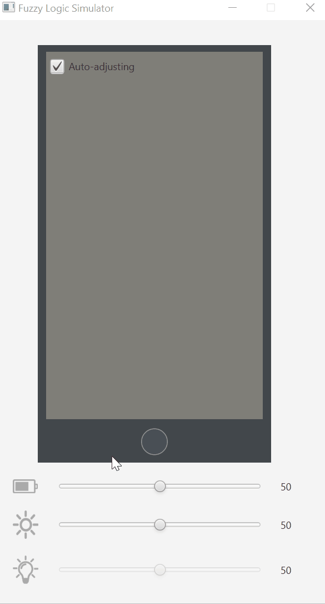

# Fuzzy Logic - Screen Brightness

This project was created for the Basics of Artificial Intelligence class at AGH University of Science and Technology. It uses the concept of fuzzy logic in order to implement an autoadjustable screen brigthness controller.

Its decision making is dependent on three variables:
* Current screen brightness
* Battery Level
* Light intensity measured by sensors

If the battery level is low the controller will not allow any drastic increases in brightness irrespective of light intensity. On the other hand if the battery level is high but the light intensity is quite low the controller will keep the screen brightness from raising too high if not necessary. In all other cases the screen brightness is regulated on a per-need basis.

  

# Technology

* Java
* JavaFX for visualisation
* jFuzzyLogic library
